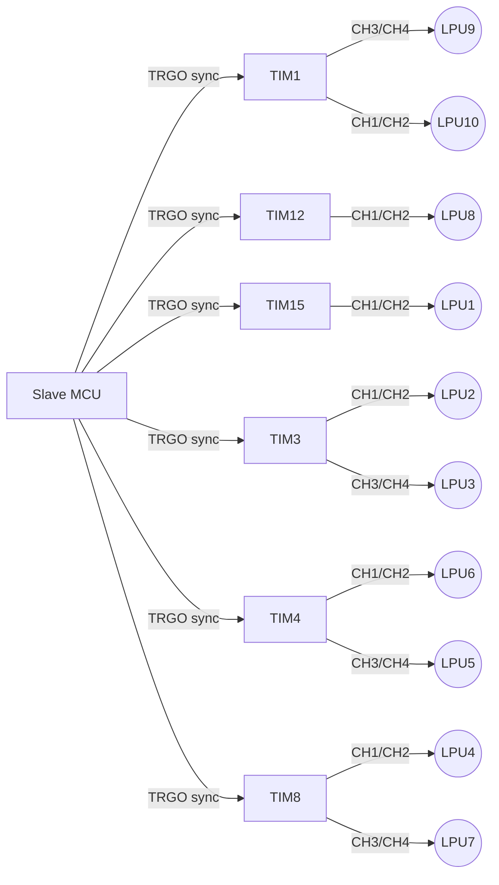

# PWM timer tree

> Generated by `arch/build.py` from `arch/lcu_h12.json`. Do not edit by hand.

```mermaid
flowchart LR
    MCU["Slave MCU"]
    TIM1["TIM1"]
    MCU -->|"TRGO sync"| TIM1
    TIM12["TIM12"]
    MCU -->|"TRGO sync"| TIM12
    TIM15["TIM15"]
    MCU -->|"TRGO sync"| TIM15
    TIM3["TIM3"]
    MCU -->|"TRGO sync"| TIM3
    TIM4["TIM4"]
    MCU -->|"TRGO sync"| TIM4
    TIM8["TIM8"]
    MCU -->|"TRGO sync"| TIM8
    TIM1 -->|"CH3/CH4"| LPU9(("LPU9"))
    TIM1 -->|"CH1/CH2"| LPU10(("LPU10"))
    TIM3 -->|"CH1/CH2"| LPU2(("LPU2"))
    TIM3 -->|"CH3/CH4"| LPU3(("LPU3"))
    TIM4 -->|"CH1/CH2"| LPU6(("LPU6"))
    TIM4 -->|"CH3/CH4"| LPU5(("LPU5"))
    TIM8 -->|"CH1/CH2"| LPU4(("LPU4"))
    TIM8 -->|"CH3/CH4"| LPU7(("LPU7"))
    TIM15 -->|"CH1/CH2"| LPU1(("LPU1"))
    TIM12 -->|"CH1/CH2"| LPU8(("LPU8"))
```
